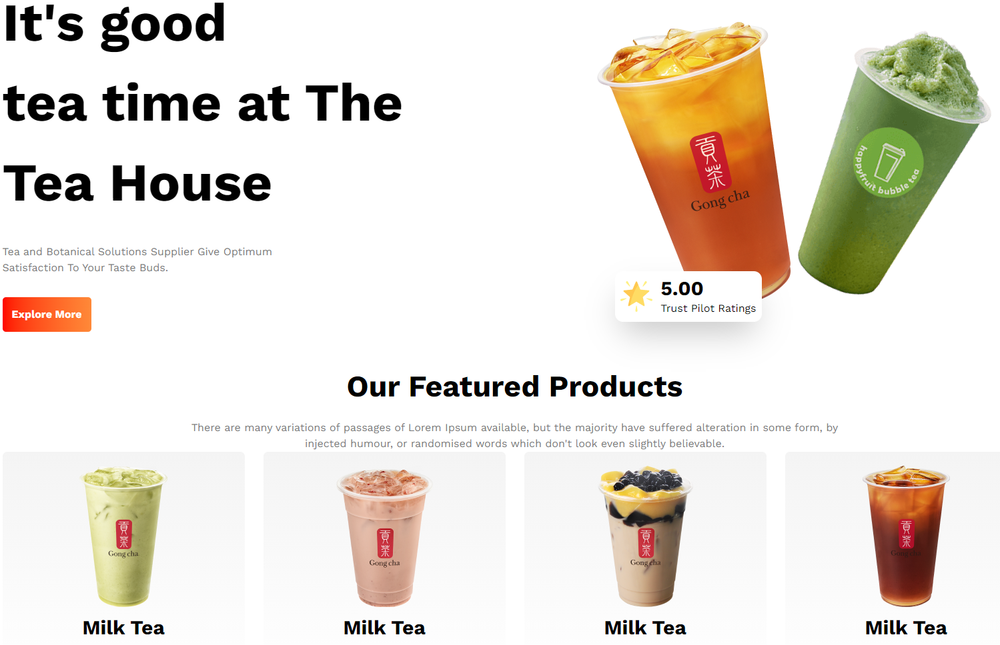

# 🍃 Tea House Landing Page


A cozy, elegant, and fully responsive landing page for a premium Tea House. This project demonstrates sophisticated layout techniques and a focus on high-quality visual storytelling using modern CSS practices.

## 🚀 Live Demo
[View Live Site](https://wazed-md-abdul.github.io/Tea_House/) 

## ✨ Key Features
- **Sophisticated Design:** Elegant typography and earthy color palettes tailored for a premium tea brand.
- **Interactive Elements:** Smooth hover effects and transitions.
- **Figma to Code:** Accurately translated from the included `tea-house.fig` design file.
- **Fully Responsive:** Optimized for mobile, tablet, and desktop viewing.

## 🛠️ Tech Stack
| Tool | Usage |
| :--- | :--- |
|  **HTML5** | Semantic structure |
|  **CSS3** | Custom styling and animations |
|  **Tailwind** | Utility-first styling framework |
|  **Figma** | Source design used for development |

## 📸 Preview

*A visual representation of the elegant Tea House layout.*

## 📂 Project Structure
```text
├── images/          # High-quality tea and lifestyle photography
├── style/           # CSS stylesheets
├── index.html       # Primary structure
├── tea-house.fig    # Original design source file
└── README.md        # Documentation
